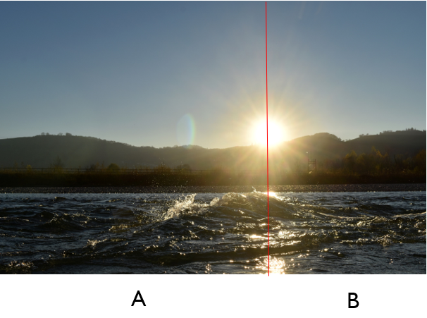
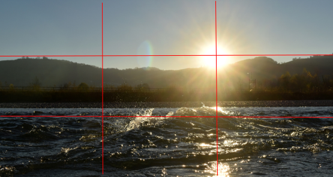

+++
title = "Goldener Schnittpunkt / Drittel-Regel "
date = "2021-02-03"
draft = false
pinned = false
image = "afsc_0208_klein.jpg"
+++
Der Goldene Schnittpunkt stellt ein harmonisch wirkendes Massverhältnis dar. Im weiten Sinne, ist der Goldene Schnittpunkt die Teilung einer Fläche in zwei ungleiche Teile A und B.

Im Zusammenhang mit dem Goldenen Schnittpunkt steht die Drittel-Regel.

Die Platzierung hervorzuhebender Objekten, wird durch die Drittel-Regel optimiert. Der Blickpunkt in der Bildmitte wirkt langweilig, verwendet man aber den Goldenen Schnitt / die Drittel-Regel, kann man ein harmonisch spannungsvolles Bild gestallten.